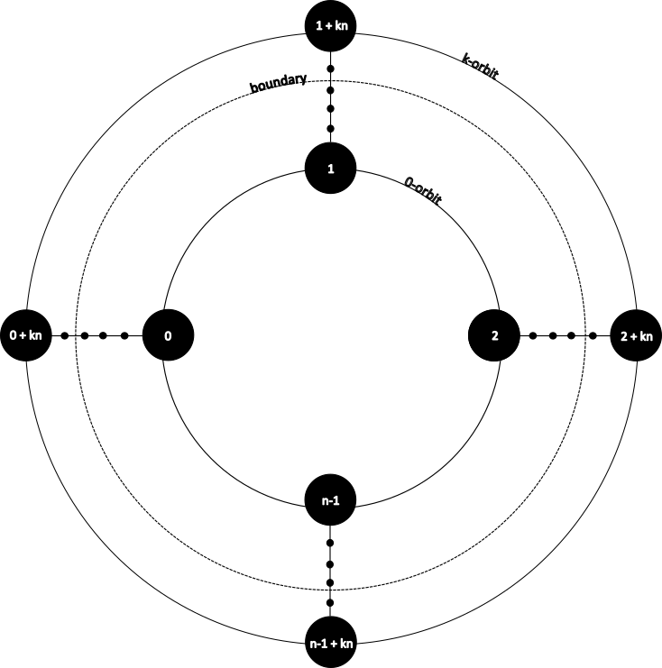

# Lincoln 

<span align="center">
    <pre>
        
    </pre>
</span>

## Table of contents

- [Lincoln](#lincoln)
  - [Table of contents](#table-of-contents)
  - [Math preface](#math-preface)
  - [Description](#description)
  - [Install](#install)
  - [Usage](#usage)
  - [Summary](#summary)

## Math preface

The object of considerations is linear congruence in form:

$ax\equiv b \space (mod \space n)$

where: $a,b \in \mathbb{Z}$ and $n \in \mathbb{N}$, $n \ge 2$. 

Sometimes it is useful to limit the result set by given boundary, so we can find general solution or limited set that: $0 \leq x \leq boundary$ and $boundary \in \mathbb{N}$

Congruence has a soltution $IFF \space \exists \space k \in \mathbb{Z}, k \cdot gcd(a,n) = b $

The most common algorithmic approach to solve this exercise is to find the **modular multiplicative inverse** $a \space mod \space b$

To achieve this we can use the **Extended Euclidian Algorithm** to compute Bézout coefficients of Bézout's identity (linear Diophantine equation): 

$ax+by=gcd(a,b)$ 

which is particularly useful when $a$ and $b$ are coprime i.e., $gcd(a,b)=1$, becasue $x$ and $b$ have particular meaning:

$x\equiv a^{-1} \space (mod \space b)$ &emsp;and&emsp; $y \equiv b^{-1} \space(mod \space a)$

in sense of symbols used in Bézout's identity.

We aim to achieve the form of linear congruence equasion where $a$ and $b$ are coprime. It is trivial that we can find $d = gdc(a,b,n)$ and simplify the linear congruence equasion to the form:

<!-- k a ≡ k b (mod k m) for any integer k -->

$\frac{a}{d}x \equiv \frac{b}{d} \space (mod \space \frac{n}{d})$, because of equivalence relation property: $ka \equiv kb \space (mod \space km)$

Next step in our computations will be verify the existence of the solution. If solution exist we can compute the modular multiplicative inverse using Extended Euclidian Algorithm:

$x_{0} \equiv a^{-1} \space(mod \space n)$

and multiply equasion by $x_{0}$:

$a^{-1}ax \equiv a^{-1}b \space (mod \space n)  \implies x \equiv a^{-1}b \space (mod \space n)$ 

In general solution of linear congruence equasion is the infinite set:

$G =$ { $x \space|\space \forall k \in \mathbb{Z},\space x = x_{0}b + kn$ }

But we will be looking for solution set $R \subset G$ limited to given boundary:

$R =$ { $x \space|\space x \in G \space\land\space 0 \leq x \leq boundary$ }

where $R$ is the finite set.

Below simple schematic is presented. In general solutions we can assume that $k \rightarrow \inf$. 0-orbit represent obvious solution. Small black points represents an infinitely large amount of orbits. For practical reasons we often will be looking for finite set of solutions like first N solutions or limited by given boundary that is natural number.

<div style="display:flex;justify-content: center;align-items: center;">
    
</div>

## Description

This package is intended for all people who want to solve the equasion in $mod \space n$ arithmetic and need simple API with comprehensive explanation of methods used. It can be treated as tutrial as well. I hope it is simple and understable. It collects all mathematic basics and description of the algotihm that can be helpful to understand the topic. Feel free to use this code on your own needs.

## Install 

```shell
npm install @scitia/lincoln
```
Requires at least TypeScript: 5.6.3

## Usage

First thing you have to do is to create object of main ```Lincoln``` class depending on your package.json type property (commonjs, module).

```ts
import { Lincoln } from '@scitia/lincoln';
const lin = new Lincoln();
```

or:

```ts
const lincoln = require('@scitia/lincoln');
const lin = new lincoln.Lincoln();
```

In every case returned data has structure as type below:

```ts
export type SolverResult = {
    ok: boolean;
    mode: string;
    explanation: string | undefined;
    message: string | undefined;
    result: number[] | number | undefined;
};
```

Result of calculations are returned in ```result``` field.

Looking for solution is very simple. We have to create object of Lincoln class, call a method ```construct()``` or each setter for required parameters: ```a```, ```b```, ```n``` according to math preface.

```ts
lin.construct(701, 529, 7); // a, b, n
const solution = lin.general(); //array of two numbers [first solution, minimal modulus]
```

Sometimes it may be more convenient for you to call each setter method:

```ts
lin.slope(701);
lin.congruent(529);
lin.modulus(7);

const solution = lin.general() //array of two numbers [first solution, minimal modulus]
```

If you need all solutions limited to given boundary you can use ```atBoundary()``` solver method instead of ```general()```:

```ts
const solution = lin.atBoundary(20); // [4, 11, 18]
```

In another case maybe you will need to know first N solutions. Than you can use ```first()``` method:

```ts
const solution = lin.first(4); // [4, 11, 18, 25]
```

If you want to know only first solution you just need to call the method ```firstOnly()```:

```ts
const solution = lin.firstOnly(); // 4
```

Other use case is when you need dynamically modify left or right linear congruence equasion side by adding or substracting values. Here comes four methods that allow you to achieve this directly ```lpus()```, ```lminus()```, ```rplus()```, ```rminus()```.

```ts
// 3x≡8 (mod 34) original form
lin.construct(3, 8, 34);

lin.lminus(4); // 3x-4≡8 (mod 34) 
lin.lplus(1); // 3x-4+1≡8 (mod 34)
lin.rplus(6, 5) // 3x-4+1≡8+6+5 (mod 34)
lin.rminus(9); // 3x-4+1≡8+6+5-9 (mod 34)
// 3x≡13 (mod 34)
const solution = lin.firstOnly(); // 27
```

## Summary

This small library provides functionalities to calculate solution for linear congruence equasions.
Please report any problems or bugs you notice. If you notice any problems please report it as an issue or give feedback if you want to extend this small library with another more advanced topics :smiley:
